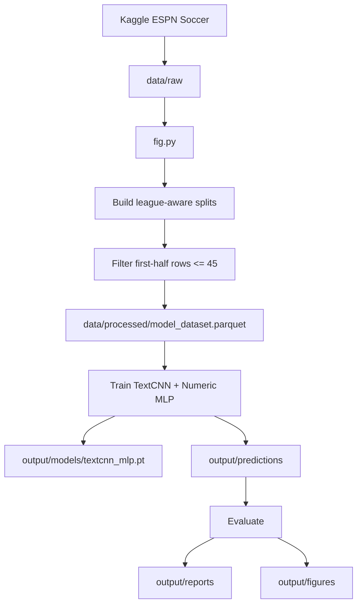
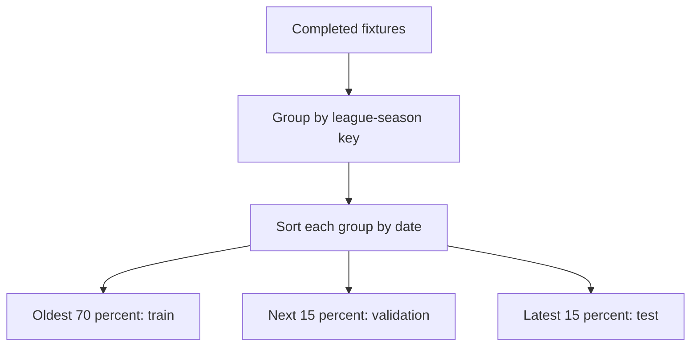
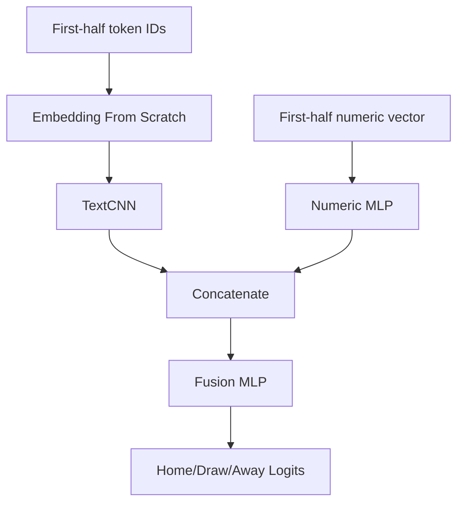

# Architecture

## Design Principles

- Reproducibility comes before convenience. Dataset download, preprocessing, training, and evaluation are command-driven by `fig.py`.
- The target is final match outcome: home win, draw, or away win.
- The forecast origin is minute 45.
- No event, key event, commentary, or unsafe lineup information after minute 45 may enter model inputs.
- Deep learning is implemented with raw PyTorch.
- Text embeddings are trained from scratch. No external pretrained language model, pretrained embedding, or language model API is used.
- The model is intentionally simple: one TextCNN for first-half text, one MLP for first-half numeric features, and one fusion classifier.

## Decisions

| Area               | Decision                                          |
| ------------------ | ------------------------------------------------- |
| Script             | `fig.py`                                          |
| Dataset            | Kaggle ESPN Soccer dataset under `data/raw/`      |
| Forecast origin    | Minute 45                                         |
| Target             | Final result: `home`, `draw`, `away`              |
| Modeling framework | Raw PyTorch                                       |
| Architecture       | First-half TextCNN plus numeric MLP classifier    |
| Validation         | Chronological split inside each league-season key |
| Command interface  | `just run` wrapping `uv run python fig.py`        |

## Data Flow

The pipeline has four responsibilities:

1. Download or reuse the local Kaggle raw dataset.
2. Convert first-half event streams into one row per match.
3. Train one hybrid text and numeric classifier.
4. Generate prediction, metric, report, and figure artifacts.

## Split Strategy

Splits are assigned inside each `seasonType-leagueId-year` group. This prevents a global date sort from putting whole competitions mostly into one split. Very small league groups fall back to train-only or one validation and one test match when possible.

## Feature Rules

| Source       | Rule                                                                                                                  |
| ------------ | --------------------------------------------------------------------------------------------------------------------- |
| Fixtures     | Final scores are used only to build labels, never as inputs.                                                          |
| Plays        | Include first-half play rows with parsed clock at or before minute 45.                                                |
| Key events   | Include first-half key-event rows with parsed clock at or before minute 45.                                           |
| Commentary   | Include commentary rows with parsed clock at or before minute 45; missing clocks are treated as pre-match/early text. |
| Lineups      | Use safe formation and starter metadata; do not use winner fields or post-cutoff substitutions.                       |
| Team stats   | Excluded because the table represents full-match statistics.                                                          |
| Player stats | Excluded until explicit lagging is implemented.                                                                       |
| Standings    | Excluded until scrape-time snapshots are converted into safe pre-match features.                                      |

## Model

The model is `FirstHalfClassifier` in `fig.py`.

For each match:

- the text branch embeds token IDs and applies several 1D convolution kernels;
- the numeric branch projects first-half event, score-state, coordinate, and safe lineup features;
- both representations are concatenated and passed through a final classifier.

There is no GRU and no time-window sequence.

## Evaluation

Evaluation reports classification quality for train, validation, and test splits.

| Metric                        | Purpose                                            |
| ----------------------------- | -------------------------------------------------- |
| Accuracy                      | Overall correct final-result predictions           |
| Macro F1                      | Class-balanced quality across home, draw, and away |
| Log loss                      | Probability quality and confidence penalty         |
| Per-class precision/recall/F1 | Class-specific behavior                            |
| Confusion matrix              | Error structure across outcome classes             |
