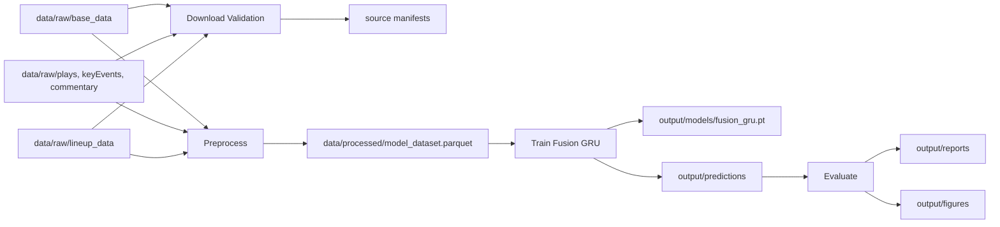
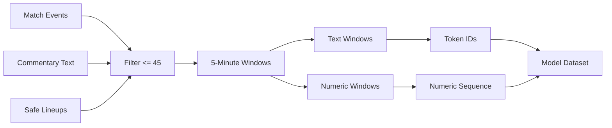
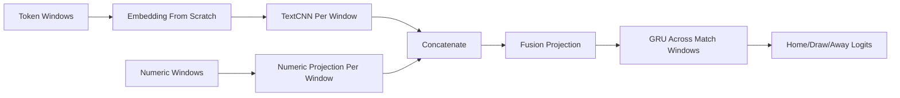

# Architecture

## Design Principles

- Reproducibility comes before convenience. Data validation, preprocessing, training, and evaluation are command-driven.
- The target is final match outcome: home win, draw, or away win.
- The forecast origin is minute 45.
- No event, key event, commentary, or unsafe lineup information after minute 45 may enter model inputs.
- Deep learning models are implemented with raw PyTorch.
- Text embeddings are trained from scratch. No external pretrained language model, pretrained embedding, or language model API is used.
- The first model trains one architecture only, so there are no separate numeric-only, text-only, Ridge, or Random Forest training paths.

## Decisions

| Area               | Decision                                                       |
| ------------------ | -------------------------------------------------------------- |
| Python package     | `src/fip/`                                                     |
| Dataset            | Local Kaggle ESPN Soccer dataset under `data/raw/`             |
| Forecast origin    | Minute 45                                                      |
| Target             | Final result: `home`, `draw`, `away`                           |
| Modeling framework | Raw PyTorch                                                    |
| Architecture       | TextCNN per window plus numeric projection plus GRU classifier |
| Validation         | Chronological train, validation, and test split                |
| Command interface  | `just` recipes wrapping stage-specific console entrypoints     |

## Data Flow

The pipeline has three core responsibilities:

1. Validate local raw ESPN files and write an auditable manifest.
2. Convert event streams into leakage-safe minute-45 match sequences.
3. Train and evaluate one hybrid classifier.

## Sequence Construction

The default cutoff and window size create 9 sequence steps.

| Window | Minute Range |
| ------ | ------------ |
| 0      | `0-5`        |
| 1      | `5-10`       |
| 2      | `10-15`      |
| 3      | `15-20`      |
| 4      | `20-25`      |
| 5      | `25-30`      |
| 6      | `30-35`      |
| 7      | `35-40`      |
| 8      | `40-45`      |

## Feature Rules

| Source       | Rule                                                                                                                  |
| ------------ | --------------------------------------------------------------------------------------------------------------------- |
| Fixtures     | Final scores are used only to build labels, never as inputs.                                                          |
| Plays        | Include first-half play rows with parsed clock at or before minute 45.                                                |
| Key events   | Include first-half key-event rows with parsed clock at or before minute 45.                                           |
| Commentary   | Include commentary rows with parsed clock at or before minute 45; missing clocks are treated as pre-match/early text. |
| Lineups      | Use safe formation and starter metadata; do not use winner fields or post-cutoff substitutions.                       |
| Team stats   | Excluded because the table represents full-match statistics.                                                          |
| Player stats | Excluded until explicit lagging is implemented.                                                                       |
| Standings    | Excluded until scrape-time snapshots are converted into safe pre-match features.                                      |

## Model

The model is `FusionGRUClassifier` in `src/fip/train.py`.

For every 5-minute window:

- the text branch embeds token IDs and applies several 1D convolution kernels;
- the numeric branch projects the numeric event vector;
- both representations are concatenated and projected into a fused window vector.

The GRU reads the 9 fused window vectors and the final hidden state feeds a three-class classifier.

## Evaluation

Evaluation uses chronological splits and reports classification quality.

| Metric                        | Purpose                                            |
| ----------------------------- | -------------------------------------------------- |
| Accuracy                      | Overall correct final-result predictions           |
| Macro F1                      | Class-balanced quality across home, draw, and away |
| Log loss                      | Probability quality and confidence penalty         |
| Per-class precision/recall/F1 | Class-specific behavior                            |
| Confusion matrix              | Error structure across outcome classes             |

The test split should be reviewed only after the selected training run is complete.
