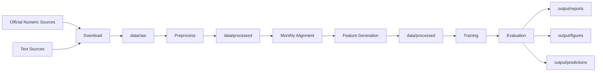
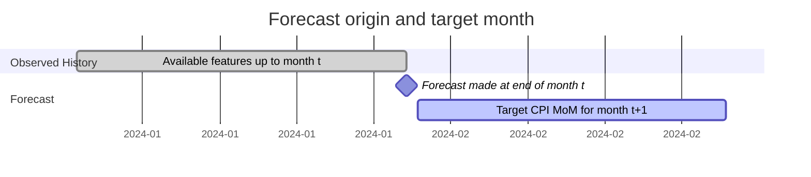
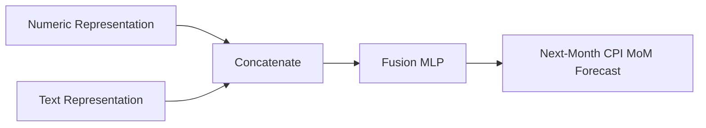

# Architecture

## Design Principles

- Reproducibility comes before convenience. Data should be downloaded, processed, trained, and evaluated from commands.
- The target is CPI month-over-month inflation only.
- Time order must be preserved. Random train/test splits are not valid for this project.
- Feature availability must respect publication dates and forecast cutoffs.
- Deep learning models are implemented with raw PyTorch.
- Text models are trained from scratch. No external pretrained language model, pretrained embedding, or language model API is used.
- The project should include simple baselines before deep models so improvements can be measured honestly.

## Decisions

| Area               | Decision                                                      |
| ------------------ | ------------------------------------------------------------- |
| Python package     | `src/tif/`                                                    |
| Target             | Next-month CPI MoM                                            |
| Modeling framework | Raw PyTorch for deep learning                                 |
| Baselines          | Naive, rolling mean, and classical machine learning models    |
| Text objective     | Inflation-pressure representation, not generic sentiment      |
| Validation         | Chronological split and rolling-origin backtesting            |
| Data storage       | Generated datasets under `data/`, source-controlled code only |
| Command interface  | `just` recipes wrapping stage-specific console entrypoints    |

## Data Flow

The data pipeline has three core responsibilities:

1. Preserve raw source files for auditability.
2. Convert all sources into a consistent monthly forecast table.
3. Prevent future information from entering features for an earlier forecast origin.

## Forecasting Timeline

For a target month `t + 1`, every numeric feature and text document must be available no later than the forecast origin. If a source has a publication delay, the delay must be modeled explicitly.

## Pipeline

### Numeric Branch

The numeric branch models macro-financial time series.

The current numeric foundation normalizes official CBRT CPI and FX data with public FRED macro-financial series before monthly alignment. Daily series such as Brent oil are aggregated to monthly average and month-end values. Monthly series are kept at their reported month and later feature generation must apply lag and cutoff rules before model training.

Feature generation uses conservative availability rules:

| Feature Group      | Availability Rule                                                     |
| ------------------ | --------------------------------------------------------------------- |
| CPI history        | CPI MoM and YoY are used from month `t - 1` and earlier               |
| Market data        | FX and Brent features can use month `t` values at the forecast cutoff |
| Delayed macro data | Industrial production and unemployment use month `t - 2` and earlier  |
| Text documents     | Documents are included only when published by the end of month `t`    |

Candidate architectures are:

| Model               | Purpose                                            |
| ------------------- | -------------------------------------------------- |
| MLP                 | Tabular deep learning baseline                     |
| 1D CNN              | Local temporal pattern extraction                  |
| MLP                 | Implemented tabular numeric deep learning baseline |
| GRU                 | Implemented lag-structured numeric sequence model  |
| 1D CNN              | Candidate future numeric sequence model            |
| Transformer encoder | Candidate future attention-based experiment        |

### Text Branch

The text branch learns whether text indicates upward or downward inflation pressure. It should not be framed as generic positive or negative sentiment. The learned text representation is used as an input to the final forecast model.

Valid text architectures for this project are:

| Model               | Purpose                                             |
| ------------------- | --------------------------------------------------- |
| TextCNN             | Implemented local phrase and n-gram pattern capture |
| BiGRU or BiLSTM     | Candidate sequential text representation            |
| Transformer encoder | Candidate attention-based text representation       |

### Fusion Model

The fusion model combines numeric and text representations and predicts the CPI MoM value for the next month.

The implemented fusion model concatenates an MLP numeric representation with a TextCNN representation and feeds the result through a small regression head.

### Baselines

Baselines are required to make the deep learning results meaningful.

| Baseline         | Role                                          |
| ---------------- | --------------------------------------------- |
| Last value       | Forecast next CPI MoM as the previous CPI MoM |
| Rolling average  | Smooth recent CPI MoM history                 |
| Ridge regression | Linear macro-financial benchmark              |
| Random forest    | Nonlinear classical benchmark                 |

## Evaluation

Evaluation must use chronological splits and optionally rolling-origin backtesting.

| Metric             | Purpose                                      |
| ------------------ | -------------------------------------------- |
| MAE                | Main interpretable error metric              |
| RMSE               | Penalizes large forecast misses              |
| Direction accuracy | Measures whether inflation movement is right |
| Baseline delta     | Compares deep models against simple models   |

The test period must stay untouched until the final model comparison.

## Interpretability

The project should include model inspection that is practical for the architecture used:

| Component | Interpretability Method                                             |
| --------- | ------------------------------------------------------------------- |
| Numeric   | Permutation importance, ablation, lag contribution analysis         |
| Text      | Token saliency, document contribution, attention inspection if used |
| Fusion    | Numeric-only vs text-only vs combined model ablation                |
