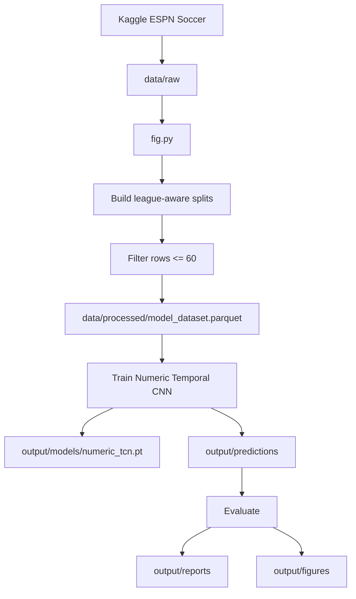
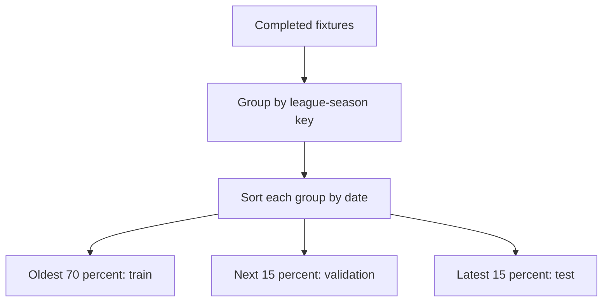
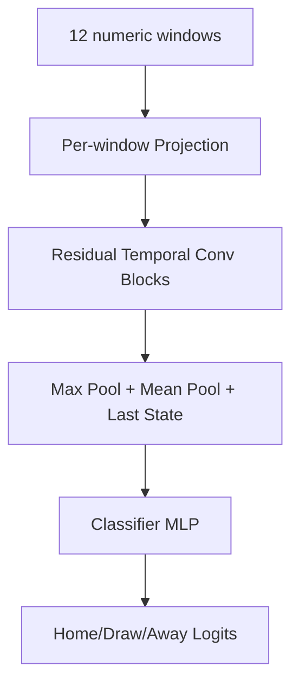

# Architecture

## Design Principles

- Reproducibility comes before convenience. Dataset download, preprocessing, training, and evaluation are command-driven by `fig.py`.
- The target is final match outcome: home win, draw, or away win.
- The forecast origin is minute 60.
- No event, key event, commentary, or unsafe lineup information after minute 60 may enter model inputs.
- Deep learning is implemented with raw PyTorch.
- The active model uses numeric 5-minute windows only; text is not used as a model input.
- The model is intentionally simple: one Temporal CNN over leakage-safe numeric windows and one classifier head.

## Decisions

| Area               | Decision                                            |
| ------------------ | --------------------------------------------------- |
| Script             | `fig.py`                                            |
| Dataset            | Kaggle ESPN Soccer dataset under `data/raw/`        |
| Forecast origin    | Minute 60                                           |
| Target             | Final result: `home`, `draw`, `away`                |
| Modeling framework | Raw PyTorch                                         |
| Architecture       | Numeric Temporal CNN over 5-minute windows          |
| Validation         | Chronological split inside each league-season key   |
| Command interface  | `just run` wrapping `uv run python fig.py`          |

## Data Flow

The pipeline has four responsibilities:

1. Download or reuse the local Kaggle raw dataset.
2. Convert first-60-minute event streams into 5-minute numeric windows per match.
3. Train one numeric temporal classifier.
4. Generate prediction, metric, report, and figure artifacts.

## Split Strategy

Splits are assigned inside each `seasonType-leagueId-year` group. This prevents a global date sort from putting whole competitions mostly into one split. Very small league groups fall back to train-only or one validation and one test match when possible.

## Feature Rules

| Source       | Rule                                                                                                                  |
| ------------ | --------------------------------------------------------------------------------------------------------------------- |
| Fixtures     | Final scores are used only to build labels, never as inputs.                                                          |
| Plays        | Include play rows with parsed clock at or before minute 60.                                                           |
| Key events   | Include key-event rows with parsed clock at or before minute 60.                                                      |
| Commentary   | Include commentary rows with parsed clock at or before minute 60; missing clocks are treated as pre-match/early text. |
| Lineups      | Use safe formation and starter metadata; do not use winner fields or post-cutoff substitutions.                       |
| Team stats   | Excluded because the table represents full-match statistics.                                                          |
| Player stats | Excluded until explicit lagging is implemented.                                                                       |
| Standings    | Excluded until scrape-time snapshots are converted into safe pre-match features.                                      |

Feature construction aggregates play, key-event, commentary, coordinate, and lineup inputs with `eventId` groupby and pivot operations inside each 5-minute window. Each window contains current-window counts, cumulative match state, explicit score-state flags, score and event differentials, coordinate summaries, safe lineup features, and leakage-safe pre-match team strength features.

Pre-match team strength is computed before each fixture date only. It includes rolling recent form, season-to-date rates, and an Elo-like rating updated after prior completed matches. Matches on the same timestamp are feature-extracted before any of them update team state, avoiding same-date leakage.

## Model

The model is `NumericWindowTCN` in `fig.py`.

For each match:

- every 5-minute window is projected into a learned numeric representation;
- residual 1D convolution blocks with GroupNorm model short temporal patterns across the 12 windows;
- max pooling, mean pooling, and the final window state are concatenated for classification.

There is no GRU, LSTM, TextCNN, or text embedding branch.

`MODEL_TYPE="mlp"` enables a flattened numeric MLP diagnostic model. It is useful for checking whether temporal convolution is providing value over a simpler tabular sequence baseline; the default active model is `MODEL_TYPE="tcn"`.

## Evaluation

Evaluation reports classification quality for train, validation, and test splits.

| Metric                        | Purpose                                            |
| ----------------------------- | -------------------------------------------------- |
| Accuracy                      | Overall correct final-result predictions           |
| Macro F1                      | Class-balanced quality across home, draw, and away |
| Log loss                      | Probability quality and confidence penalty         |
| Per-class precision/recall/F1 | Class-specific behavior                            |
| Confusion matrix              | Error structure across outcome classes             |
